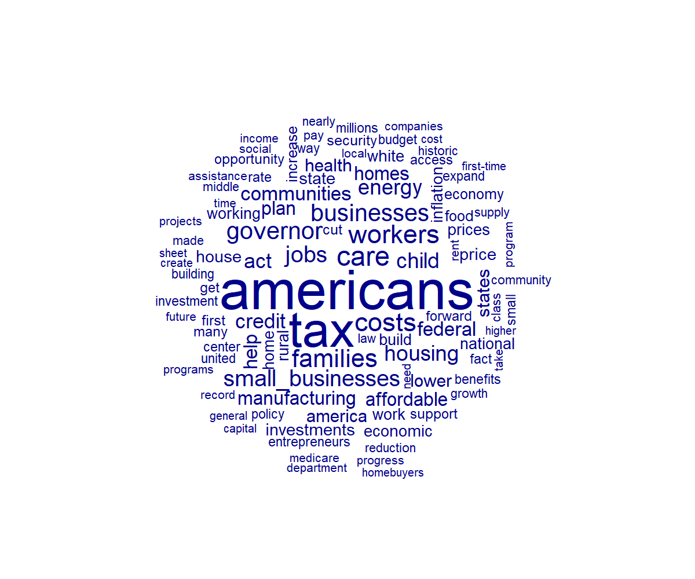
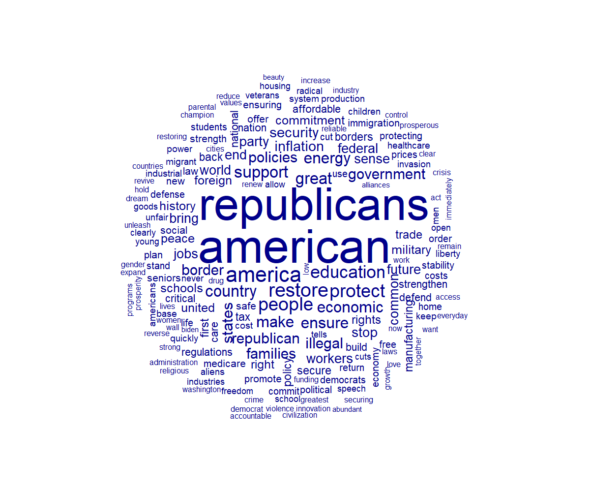
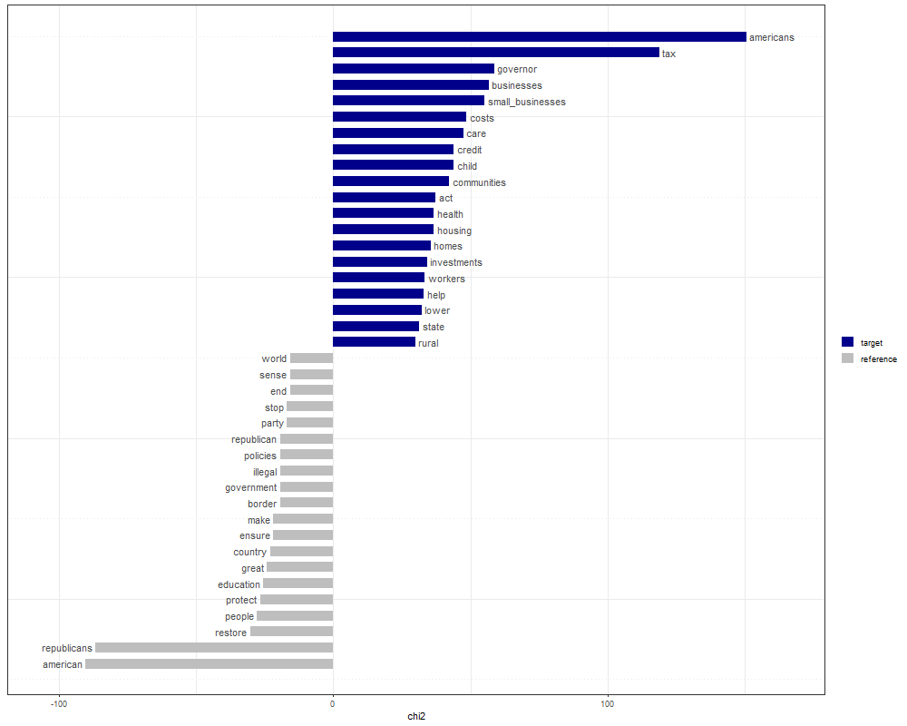

# US Presidential Keyness Plot

In this project, I have investigated policies of US presidential candidates in the 2024 election. I have created word clouds from Harris and Trump’s policy documents that reveal what issues they are focusing on and their plans after being elected. I have used policy documents of Harris and Trump extracted from their websites to create word clouds for each candidate and a keyness plot.

## Word Cloud for Harris's Policies

This word cloud shows Harris's plans as a presidential candidate. The words that are used frequently are americans, tax, care, costs, workers, families, jobs, businesses, governor, affordable, housing, child, manufacturing and energy. 

## Word Cloud for Trump's Policies

The word Republicans is as frequent as american. Other frequent words are america, restore, great, people, education, protect and support which shows that restoring america, protecting it and making it a great country is his priorities. Education also seems to be his major focus. 

## Keyness Plot

As we saw earlier, the most frequent words in Harris's agenda are tax, small businesses, costs, care, child, communities, health, housing and workers. It is clear that she has plans in the issues of tax, businesses in particular small businesses, health care, issues related to other communities such as Latino and Black communities, housing and addressing issues related to working families.
In Trump's agenda, however, the most frequent words are restore, people, protect, education, great, country, border and illegal. It is clear that Trump has general plans and there aren't specific issues that he seeks to address except education and illegal immigration or border control.